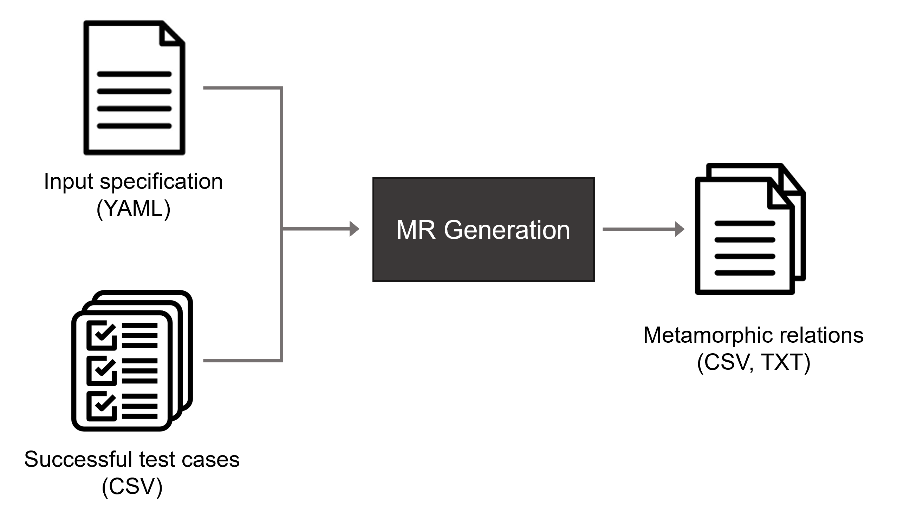

# MRG (Metamorphic Relation Generator)
Specification-Driven Automated Identification of Metamorphic Relations for Query-Based Systems.

A **query-based system (QBS)** is a software system that supports searching and displaying data based on user queries. Typical examples of QBSs are information systems like OpenERP (supporting queries like "retrieve invoices issued before 2022"), e-commerce sites like eBay (e.g., "search for microphones under $100"), software project platforms like GitHub (e.g., "get Node.js projects with less than 10 committers"), video streaming apps like Netflix (e.g., "order series by popularity"), email clients like Gmail (e.g., "display messages including the word _conference_ in the subject"),  or even video games like World of Warcraft (e.g., "get progression data for character _Thrall_ in _Blackrock_ realm").

Testing QBSs is extremely challenging as they suffer from the oracle problem: it is very difficult, often infeasible, to assess whether the output of a query is correct, either because the expected output is unknown or because it is hard to compare it to the observed output. Metamorphic testing (MT) alleviates the oracle problem by considering the relations among the input and output of two or more executions of the program under test, known as _metamorphic relations_ (MRs).

In this work, we propose a method for the **automated generation of MRs for QBSs**. Our work is based on the observation that, given a QBS under test and an MR pattern, the applicability of the pattern is typically related to the existence of a certain type of parameter in the QBS. For example, the _conjunctive conditions_ pattern is typically applicable whenever a QBS provides _filter_ parameters for restricting searches. Hence, we propose classifying input parameters based on their potential to create instances of the target patterns, and then we create MRs by systematically adding, removing, and replacing input parameters and their values from the source test cases.

The following figure summarizes the basic functioning of the approach. Our method receives two inputs: an input specification of the QBS under test, and a set of existing test cases revealing no failures (i.e., source test cases). The input specification must include, among others, a classification of the query parameters based on their potential to create MRs derived from several MR patterns (e.g., _conjunctive conditions_, _shuffling_, and _disjoint partitions_, among others). Then, a set of transformations are applied to the input source test cases generating the output MRs. Those MRs can then be used by testers for the creation of specific metamorphic test cases, either manually or automatically, by assigning specific test values to input parameters.

